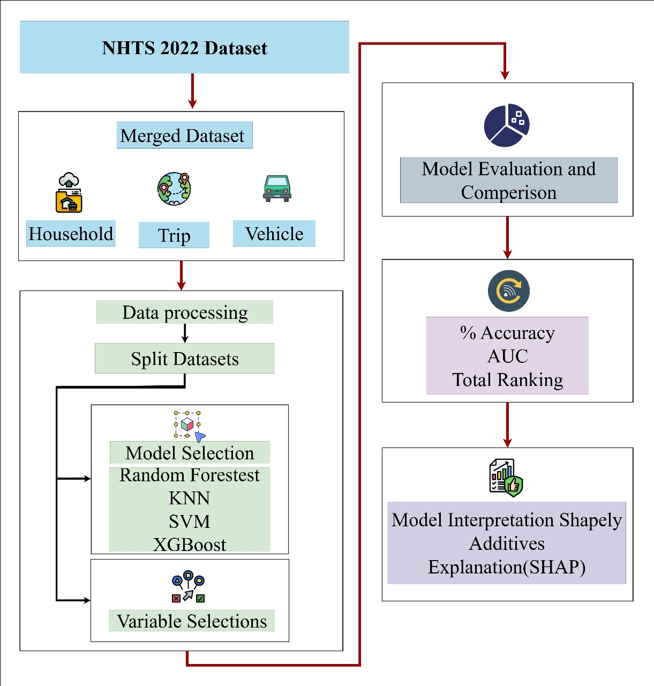

# Explaining-Household-Access-to-Heavy-Rail-Services-Using-Interpretable-Machine-Learning
ML models (RF, SVM, KNN, XGBoost) predict household heavy rail access using NHTS 2022 data. After preprocessing and 5 fold tuning, models reach about 96 percent accuracy. SHAP shows proximity to stations, vehicle availability, and urban density as key drivers, giving interpretable insights for transport policy.

# Methodology

# Result
| Model         | Accuracy | Macro F1 | Mean CV Score | CV Std Dev |
|---------------|----------|---------|---------------|----------|
| KNN           | 0.8199   | 0.58    | 0.7906        | 0.0050   |
| SVM           | 0.6439   | 0.59    | 0.6331        | 0.0424   |
| XGBoost       | 0.9613   | 0.94    | 0.9560        | 0.0040   |
| Random Forest  | 0.9646   | 0.95    | 0.9587        | 0.0065   |

<table>
  <tr>
    <td align="center">
       
      <em>SHAP Bar plot for MSA with Heavy Rail Access</em>
    </td>
    <td align="center">
       
      <em>SHAP Bar plot for MSA without Heavy Rail Access</em>
    </td>
  </tr>
</table>

<table>
  <tr>
    <td align="center">
       
      <em>SHAP Beeswarm plot for MSA with Heavy Rail Access</em>
    </td>
    <td align="center">
       
      <em>SHAP Beeswarm plot for MSA without Heavy Rail Access</em>
    </td>
  </tr>
</table>
